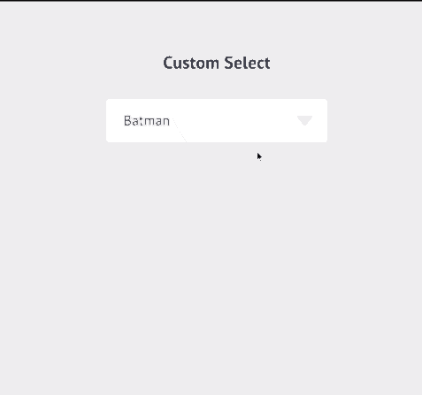

# Custom Dropdown

Javascript based Custom Dropdown plugin to style the HTML Select tag.

  View the Custom Dropdown live [here](https://karanmehta.github.io/custom-select/).

  

### How to use this plugin
* Add js & css files (custom select)
* Wrap select tag with div.custom-select
```
<div class="custom-select">
  <select>
    <option>Option 1</option>
    <option>Option 2</option>
    <option>Option 1</option>
  </select>
</div>
```

  
### What I learned

* How to dispatch custom JS Events cross-browser

### Todos

 - Cross Browser Testing (Done)
 - Optimizing JS (In progress)
 - Enhancing UI
 - Option to enable/disable on mobile and tablet

License
----

Mozilla Public License 2.0